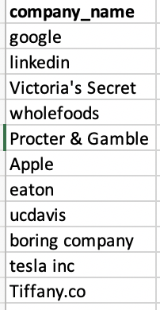
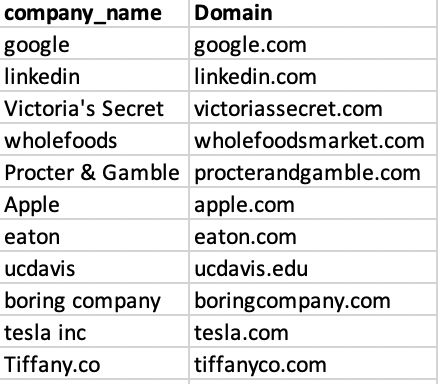

# company_name_to_doman_name

## Core Code: 
```
def get_domain_name(name):
    #preocess search string
    name = re.sub("inc|INC|Inc|/.co|/.Co|LLP|llp|LLC|llc", "", name.lower())
    name = re.sub("&", "and", name.lower())
    name = re.sub("#|'|-|^|$|@|!|~|\.|\*", "", name.lower())
    #call API and retrive result
    try:
        result = clearbit.Company.find(domain =name+'.com', stream=True)
        if company != None:
            return result['domain']
        else: 
            return "-"
    #error handling for incorrect company names 
    except:
        return "check name"
```

# input 


# Output


Usage: 
1. use the sample company_name.csv or create your own list of company names in csv file that looks like provided csv

2. Open company_domain_name.ipynb in colab or jupiter notebook 

3. Replace "company_name.csv" with your input file name in second code block

4. Sign up for free and obtain an API key for free in https://clearbit.com/ 

5. Replace "Your API Key" in the code with your clear API key. Example: clearbit.key = 'kdshjfioljehfnkad127463i47dsnfkdsjf'

6. run the code from top to buttom 

6. Bingo, you have company names converted to domain names 

Please email author at: '''chgao@ucdavis.edu''' if you have any comments or problems running the little program

Auther is a Business Analytics student in UC Dvis at San Francisco CA seeking a Data Analytics (Science) or Business Analytics job in Bay Area. 

